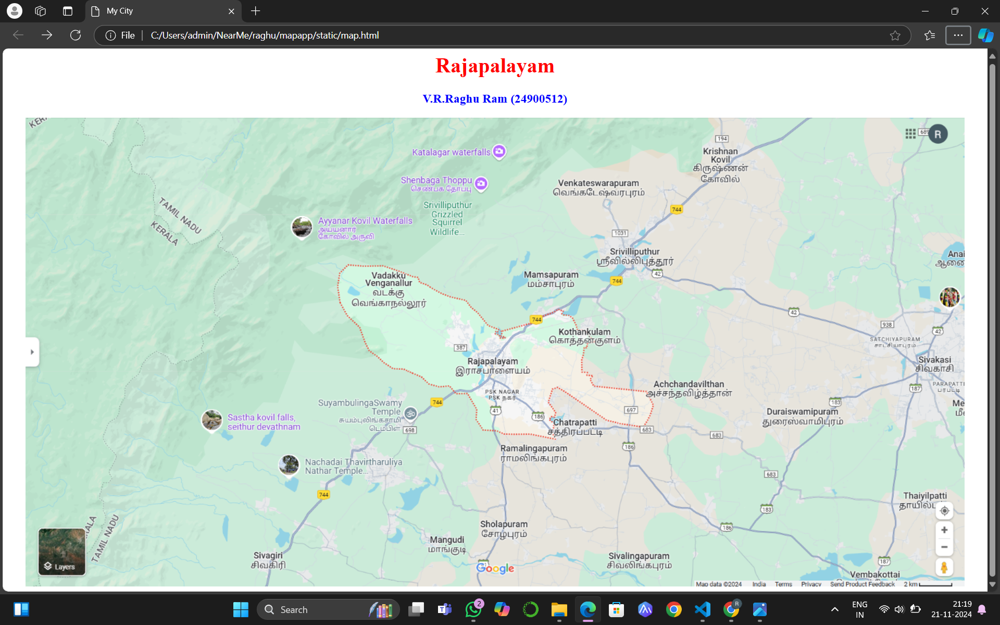
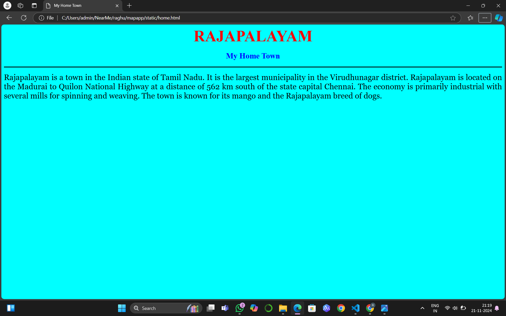
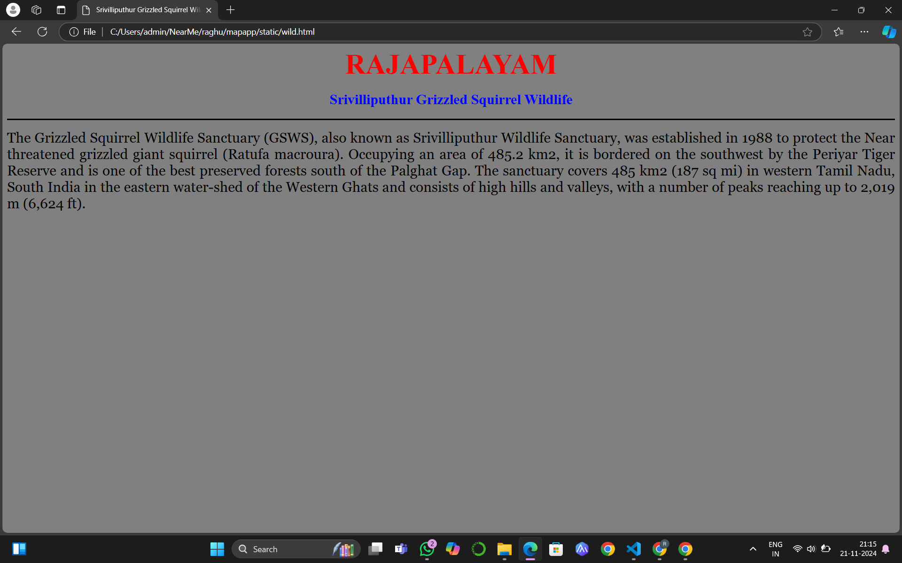
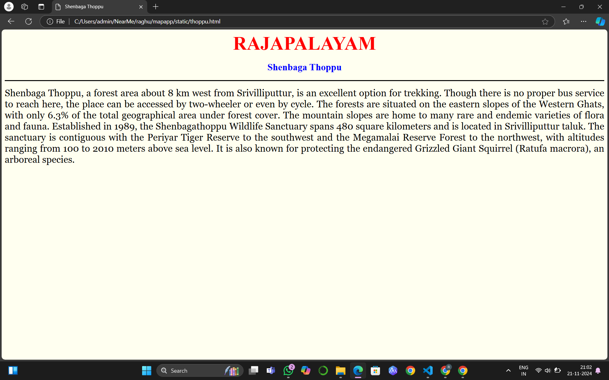
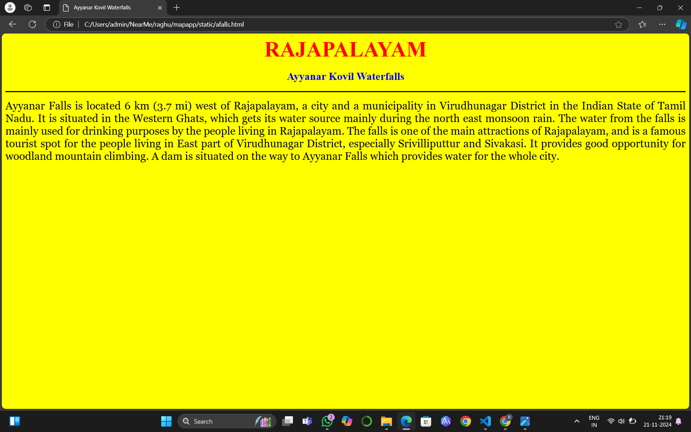
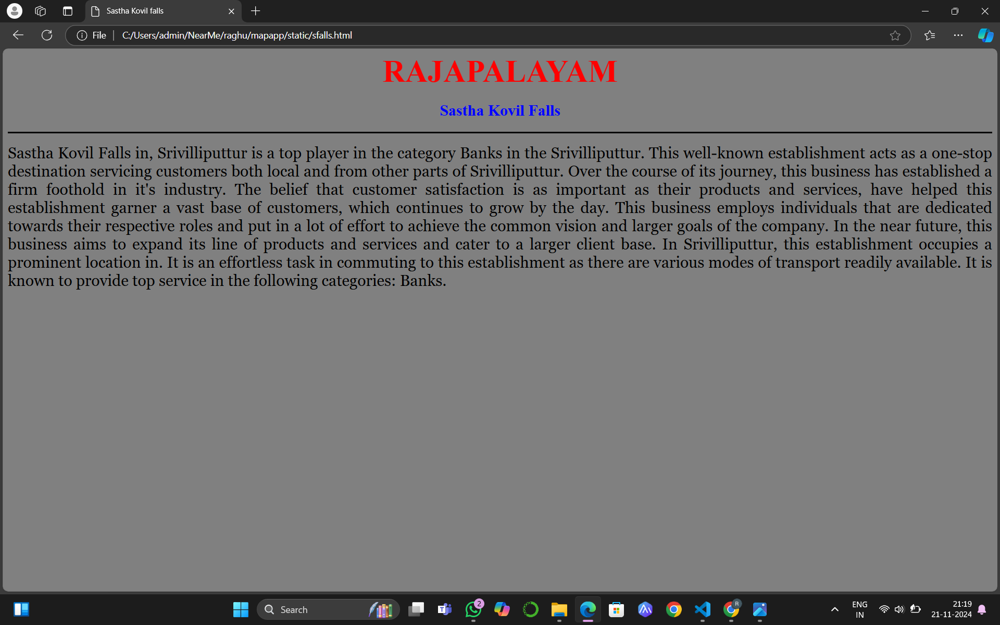

# Ex04 Places Around Me
## Date: 21/11/2024

## AIM
To develop a website to display details about the places around my house.

## DESIGN STEPS

### STEP 1
Create a Django admin interface.

### STEP 2
Download your city map from Google.

### STEP 3
Using ```<map>``` tag name the map.

### STEP 4
Create clickable regions in the image using ```<area>``` tag.

### STEP 5
Write HTML programs for all the regions identified.

### STEP 6
Execute the programs and publish them.

## CODE
```
map.html

<html >
<head>
<title>My City</title>
</head>
<body>
<h1 align="center">
<font color="red"><b>Rajapalayam</b></font>
</h1>
<h3 align="center">
<font color="blue"><b>V.R.Raghu Ram (24900512)</b></font>
</h3>
<center>

<map name="MyCity">
    <area target="" alt="Srivilliputhur Grizzled Squirrel Wildlife" title="Srivilliputhur Grizzled Squirrel Wildlife" href="wild.html" coords="590,126,694,180" shape="rect">
    <area target="" alt="Sastha kovil falls" title="Sastha kovil falls" href="sfalls.html" coords="252,440,444,508" shape="rect">
    <area target="" alt="Ayyanar kovil Waterfalls" title="Ayyanar kovil Waterfalls" href="afalls.html" coords="390,135,592,196" shape="rect">
    <area target="" alt="Shenbaga Thoppu" title="Shenbaga Thoppu" href="thoppu.html" coords="556,74,720,117" shape="rect">
    <area target="" alt="My Home Town" title="My Home Town" href="home.html" coords="525,225,606,255,728,310,780,310,844,306,949,477,702,470,596,377,568,371,537,352,509,314,482,266,502,226" shape="poly">
</map>
</center>
</body> 
</html>

home.html

<html>
    <head>
        <title>
            My Home Town
        </title>

    </head>
    <body bgcolor="cyan">
        <h align="center">
            <center>
            <font size="7" color="red"><b> RAJAPALAYAM</b></font>
            </center>


        </h>
        <h3 align="center">
            <font size ="5" color="blue"><b> My Home Town</b></font>

        </h3>
        <hr size="3" color="black">
        <p align="justify">
            <font face="Georgia" size="5">
                Rajapalayam is a town in the Indian state of Tamil Nadu. It is the largest municipality in the Virudhunagar district. Rajapalayam is located on the Madurai to Quilon National Highway at a distance of 562 km south of the state capital Chennai. The economy is primarily industrial with several mills for spinning and weaving. The town is known for its mango and the Rajapalayam breed of dogs.


            </font>
        </p>
    </body>

</html>

afalls.html

<html>
    <head>
        <title>
            Ayyanar Kovil Waterfalls
        </title>

    </head>
    <body bgcolor="yellow">
        <h align="center">
            <center>
            <font size="7" color="red"><b> RAJAPALAYAM</b></font>
            </center>


        </h>
        <h3 align="center">
            <font size ="5" color="blue"><b> Ayyanar Kovil Waterfalls</b></font>

        </h3>
        <hr size="3" color="black">
        <p align="justify">
            <font face="Georgia" size="5">
                Ayyanar Falls is located 6 km (3.7 mi) west of Rajapalayam, a city and a municipality in Virudhunagar District in the Indian State of Tamil Nadu. It is situated in the Western Ghats, which gets its water source mainly during the north east monsoon rain. The water from the falls is mainly used for drinking purposes by the people living in Rajapalayam.

The falls is one of the main attractions of Rajapalayam, and is a famous tourist spot for the people living in East part of Virudhunagar District, especially Srivilliputtur and Sivakasi. It provides good opportunity for woodland mountain climbing. A dam is situated on the way to Ayyanar Falls which provides water for the whole city.

            </font>
        </p>
    </body>

</html>

thoppu.html

<html>
    <head>
        <title>
            Shenbaga Thoppu
        </title>

    </head>
    <body bgcolor="ivory">
        <h align="center">
            <center>
            <font size="7" color="red"><b> RAJAPALAYAM</b></font>
            </center>


        </h>
        <h3 align="center">
            <font size ="5" color="blue"><b> Shenbaga Thoppu</b></font>

        </h3>
        <hr size="3" color="black">
        <p align="justify">
            <font face="Georgia" size="5">
                Shenbaga Thoppu, a forest area about 8 km west from Srivilliputtur, is an excellent option for trekking. Though there is no proper bus service to reach here, the place can be accessed by two-wheeler or even by cycle.

The forests are situated on the eastern slopes of the Western Ghats, with only 6.3% of the total geographical area under forest cover. The mountain slopes are home to many rare and endemic varieties of flora and fauna. Established in 1989, the Shenbagathoppu Wildlife Sanctuary spans 480 square kilometers and is located in Srivilliputtur taluk. The sanctuary is contiguous with the Periyar Tiger Reserve to the southwest and the Megamalai Reserve Forest to the northwest, with altitudes ranging from 100 to 2010 meters above sea level. It is also known for protecting the endangered Grizzled Giant Squirrel (Ratufa macrora), an arboreal species.
            </font>
        </p>
    </body>

</html>

sfalls.html

<html>
    <head>
        <title>
            Sastha Kovil falls
        </title>

    </head>
    <body bgcolor="grey">
        <h align="center">
            <center>
            <font size="7" color="red"><b> RAJAPALAYAM</b></font>
            </center>


        </h>
        <h3 align="center">
            <font size ="5" color="blue"><b>Sastha Kovil Falls</b></font>

        </h3>
        <hr size="3" color="black">
        <p align="justify">
            <font face="Georgia" size="5">
                Sastha Kovil Falls in, Srivilliputtur is a top player in the category Banks in the Srivilliputtur. This well-known establishment acts as a one-stop destination servicing customers both local and from other parts of Srivilliputtur. Over the course of its journey, this business has established a firm foothold in it's industry. The belief that customer satisfaction is as important as their products and services, have helped this establishment garner a vast base of customers, which continues to grow by the day. This business employs individuals that are dedicated towards their respective roles and put in a lot of effort to achieve the common vision and larger goals of the company. In the near future, this business aims to expand its line of products and services and cater to a larger client base. In Srivilliputtur, this establishment occupies a prominent location in. It is an effortless task in commuting to this establishment as there are various modes of transport readily available. It is known to provide top service in the following categories: Banks.
            </font>
        </p>
    </body>

</html>

wild.html

<html>
    <head>
        <title>
            Srivilliputhur Grizzled Squirrel Wildlife
        </title>

    </head>
    <body bgcolor="grey">
        <h align="center">
            <center>
            <font size="7" color="red"><b> RAJAPALAYAM</b></font>
            </center>


        </h>
        <h3 align="center">
            <font size ="5" color="blue"><b>Srivilliputhur Grizzled Squirrel Wildlife</b></font>
            

        </h3>
        <hr size="3" color="black">
        <p align="justify">
            <font face="Georgia" size="5">
                The Grizzled Squirrel Wildlife Sanctuary (GSWS), also known as Srivilliputhur Wildlife Sanctuary, was established in 1988 to protect the Near threatened grizzled giant squirrel (Ratufa macroura). Occupying an area of 485.2 km2, it is bordered on the southwest by the Periyar Tiger Reserve and is one of the best preserved forests south of the Palghat Gap.

                The sanctuary covers 485 km2 (187 sq mi) in western Tamil Nadu, South India in the eastern water-shed of the Western Ghats and consists of high hills and valleys, with a number of peaks reaching up to 2,019 m (6,624 ft).
            </font>
        </p>
    </body>

</html>

```


## OUTPUT














## RESULT
The program for implementing image maps using HTML is executed successfully.
